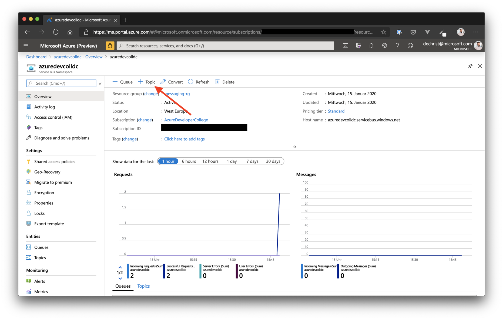
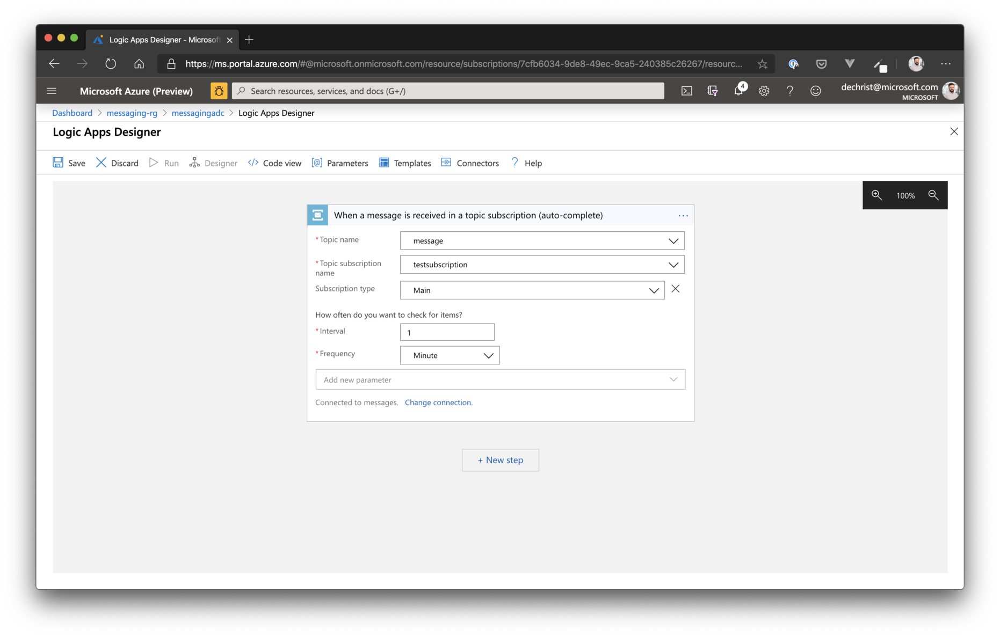
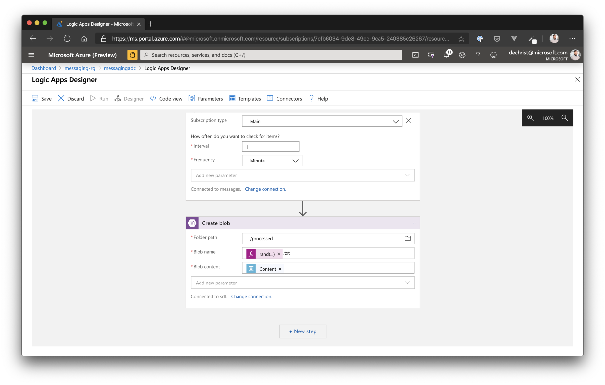
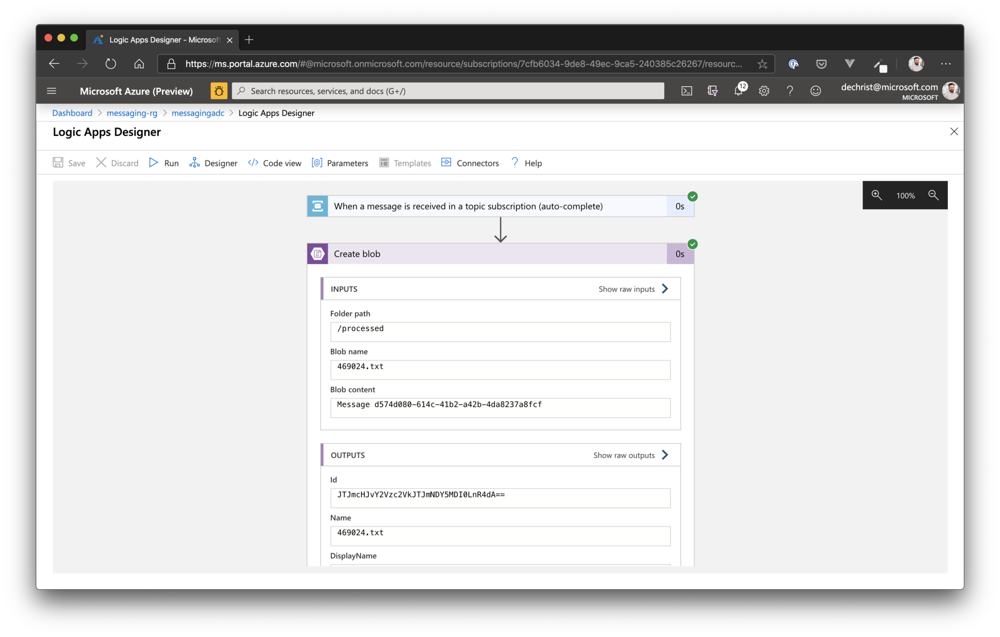

# Challenge 3 (optional): Messaging

⏲️ *Est. time to complete: 45 min.* ⏲️

## Here is what you will learn 🎯

In this _optional_ challenge, you will get to know Azure messaging offerings to loosely connect services with each other. You will use _Azure Service Bus Topics_ as an example. _Azure Storage Queues_ will be used in the next [Break Out session](./challenge-bo-2.md).

In detail, we will use:

- _Azure Service Bus_ for pub/sub scenarios (Consumer/Producer pattern)
- _Azure Logic Apps_ to subscribe to topics and process them

## Table Of Contents

1. [Azure Service Bus Publish / Subscriber Pattern](#azure-service-bus-publish-subscriber-pattern)
2. [Play Time](#play-time)
3. [Azure Samples](#azure-samples)
4. [Cleanup](#cleanup)

## Azure Service Bus Publish / Subscriber Pattern

### Create an Azure Service Bus Namespace

To use Azure Service Bus, you first need to create a _namespace_ with a globally unique name. As done before with other services:

- create a resource group, e.g. _messaging-rg_ in West Europe
- Click on **"Create Resource"**
- Search for _"Service Bus"_ and click on **"Create"**

Now fill out the form:

- Give your Service Bus a unique name
- Choose the Pricing Tier _Standard_.

When the Service Bus is created, open it in the Azure Portal and add a new _Topic_:



Give the _Topic_ a name, e.g. `message` and leave the other parameters as proposed by Azure.

When the topic has been created:

- Open it in the portal
- create a _Subscription_ via the menu bar
- Give it a name, e.g. _testsubscription_
- Set the _"Max delivery count"_ to `10`
- Leave all other parameters as proposed by the portal

:::tip
📝 _"Max delivery count"_ defines how often Azure should try to deliver a message.
:::

When you created the **Topic** and the **Subscription** have been created, we need to copy the **Connection String** to our Service Bus

- Go to **"Shared Access Policy"**
- Choose the **"RootManagedSharedAccessKey"** of the Service Bus (_not the topic!_)
- Copy/note down the **Primary Connection String**

### Add a Producer

Now open Visual Studio Code and open the folder `day2/challenges/sbtester`. This folder contains a sample application that can send messages to a Service Bus Topic, like the one we have just created.

Open `Program.cs` and enter the connection string and the topic name to the predefined variables.

```csharp
const string ServiceBusConnectionString = "<your_connection_string>";
const string TopicName = "<your_topic_name>";
```

Make yourself familiar with the code and examine, how messages are created and sent to Azure Service Bus. If you are done with that, run the sample application.

Open a terminal in the folder `day2/challenges/sbtester` and execute:

```shell
$ dotnet build && dotnet run
Microsoft (R) Build Engine version 16.4.0+e901037fe for .NET Core
Copyright (C) Microsoft Corporation. All rights reserved.

  Restore completed in 32.32 ms for /Users/christiandennig/dev/azure-developer-college/day2/challenges/sbtester/sbtester.csproj.
  sbtester -> /Users/christiandennig/dev/azure-developer-college/day2/challenges/sbtester/bin/Debug/netcoreapp3.1/sbtester.dll

Build succeeded.
    0 Warning(s)
    0 Error(s)

Time Elapsed 00:00:01.29
======================================================
Press ENTER key to exit after sending all the messages.
======================================================
Sending message: Message d31e0280-d300-4a91-8b98-c84b0746040a
Sending message: Message 76ef548c-9483-439e-8b1f-ee9c1580dc50
Sending message: Message 383b103b-ab00-4162-ae8c-9ad6dc67669e
Sending message: Message e855bbc0-e74c-4739-ba65-33754d5aedce
Sending message: Message 424f5f20-074c-45a4-9f67-97c7cf43d027
Sending message: Message 76b35c84-1fe0-48f7-a82c-a279db2e0fec
Sending message: Message 25ece212-5a4c-45e1-a04d-bc3ac07a9058
Sending message: Message 8f0feabe-40fc-405b-a46d-8a6901805152
Sending message: Message e9f1ca91-82c5-40db-ad3f-e5f483424556
Sending message: Message d61b256c-5c8c-482c-904a-63d322003c70
```

🎉 _Congratulations_ - you have just sent your first 10 messages to an Azure Service Bus Topic. Check that the messages have arrived in the subscription queue.


So, now let's create the subscriber that picks up the messages and processes each message. We could use another console application, but that's more than boring! We will use an Azure Logic App..._Serverless Resprise_..., so to say!

### Add a Consumer

In the Portal create a new _Azure Logic App_:  

- Press **"Create a resource"**
- Give it a unique name
- Select consumption plan
- Use the same resource group as for the Service Bus (_messaging-rg_)
- Put it in "West Europe".

When the Logic App has been deployed:

- Open it in the Portal
- Click on **"Blank logic App"** in the _Templates_ section
- Search for **"service bus topic"** in the search box
- Choose **"When a message is received in a topic subscription (auto-complete)**.


Now give the connection a name and choose the Service Bus you created in the previous chapter. When the connection to the Service Bus is established, you can specify the _Topic_ and the _Subscription_ to use. Your Logic App should now look like this:



You have just created the trigger connection between the Logic App and your Service Bus Topic/Subscription.

Now, it's up to you what to do now with the messages, regarding the 200+ connectors we have in Azure Logic Apps! You can follow along with the sample that takes messages and creates blobs on a Storage Account.

:::tip
📝 You can also connect e.g. your O365 Mail or Gmail account and send a few messages to your colleagues next to you or add them to a database, a SAP System, Salesforce, use Azure Cognitive Services to analyze sentiment. Imagine the possibilities - so, be creative 😃
:::

Here, we will follow the _boring path_ and put the messages in a storage account blob container.

:::tip
📝 If you have already deleted the Storage Account from the previous challenge, go and create a new one and add a container! You now know, how this is can be done.
:::

Back in the Logic App, you need to add a new step:

- Click on the button **New Step**
- Enter "blob" in the search field
- Select **"Create Blob"** from the suggested Actions
- Enter a name for the _connection_ and choose the appropriate Storage Account
- Click **"Create"**.

Configure the action:

- Choose the container to store the messages to (_Folder Path_).
- For the _blobname_, we simply let Azure create one for us. In the Expression tab, enter...`rand(100000,999999)` ...followed by ".txt".
- For _Blob Content_, choose the predefined field "Content". If that doesn't appear in the dropdown, switch to the Expression tab an enter `base64ToString(triggerBody()?['ContentData'])`

:::tip
📝 The message body is a _base64 encoded_ string we must decode first.
:::

The workflow in the designer should now look like that:



Save the Logic App and click on the **"Run"** button in the command bar.

Now got back to the _sbtester_ app and run it again. A few seconds later, after the messages have been sent, you should see a successfully processed Service Bus message.



Also check the Storage Explorer and have a look at the files that have been written:


## Play Time

You have seen how many connectors Azure Logic Apps has "under the hood". Take the same scenario and adjust the messages to your needs (e.g. send JSON) and connect to another service, maybe one outside of Azure? (Gmail, Outlook, O365, SAP, Twitter...?!)

🥳 **Happy Hacking** 🥳

## Azure Samples

Azure LogicApps code samples:

- <https://docs.microsoft.com/samples/browse/?expanded=azure&products=azure-logic-apps>

Azure Service Bus code samples:

- <https://docs.microsoft.com/samples/browse/?expanded=azure&filter-products=service%20b&products=azure-service-bus>

## Cleanup

Remove the sample resource group via:

```shell
az group delete -n messaging-rg
```

[◀ Previous challenge](./03-challenge-serverless.md) | [🔼 Day 2](../README.md) | [Next challenge ▶](./05-challenge-bo-2.md)
